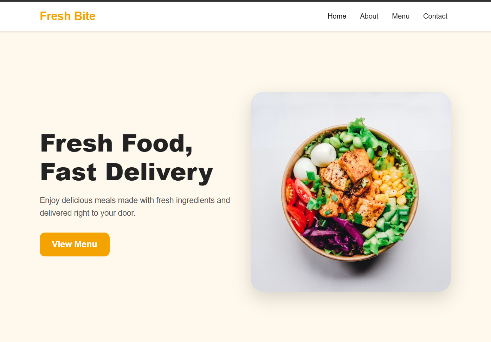
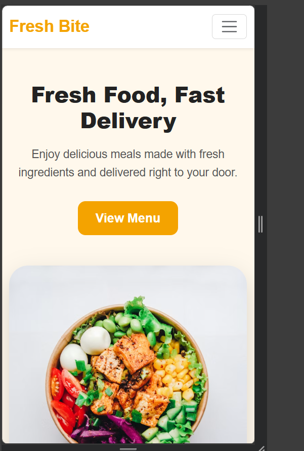

# Fresh Bite - Restaurant Landing Page

Fresh Bite is a simple and responsive restaurant landing page built using HTML, CSS, Bootstrap, and basic JavaScript.

## Live Demo

https://meeedoooo.github.io/fresh-bite-landing-page/
## Features

- Responsive design for desktop, tablet, and mobile
- Clean navigation bar
- Hero section
- About section
- Menu cards
- Contact form
- Footer
- Mobile navbar auto close using JavaScript

## Technologies Used

- HTML5
- CSS3
- Bootstrap 5
- JavaScript

## Project Preview

### Desktop View

### Mobile View

## Notes

This is a static frontend project. It does not include backend, database, or real form submission.

## Created By

Ahmed Hammad
